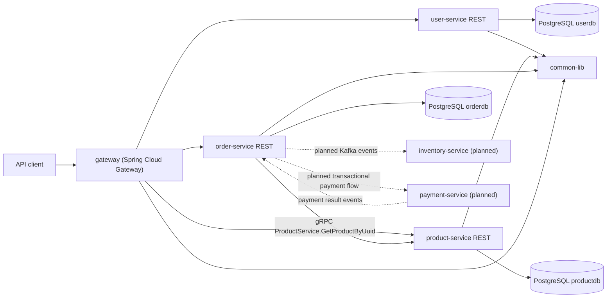

# ShopSphere
ShopSphere is a Java 25 ecommerce portfolio project that explores a microservice-style backend for users, catalog, orders, and future inventory/payment flows.

The project is intentionally a learning/portfolio codebase. Some modules are implemented, while others are declared as future work so the architecture can grow toward a fuller ecommerce platform.

## Architecture


### Responsibilities
- `gateway`: Spring Cloud Gateway edge service. It validates JWTs, forwards user context to downstream services, handles CORS/rate limiting/logging, and exposes a single public `/api/v1/**` namespace.
- `user-service`: owns user registration, login, password hashing, roles, and JWT issuance. Future scope includes user profile endpoints, seller signup, password reset, email verification, and refresh tokens.
- `product-service`: owns product/category catalog data today. It exposes customer catalog reads, admin product management, and an internal-only gRPC lookup used by orders.
- `order-service`: owns customer order creation and order history. It fails order creation if product lookup fails, and will later publish events for async inventory workflows.
- `inventory-service`: planned source of truth for stock levels, reservations, and stock adjustments.
- `payment-service`: planned transactional payment service using a fake provider for demo mode, with a Stripe-style integration as a likely future extension.
- `common-lib`: shared library for cross-service DTOs and security helpers. DTOs are expected to move toward explicit API contracts over time.

### Data Flow
1. A customer registers or logs in through `user-service` at the intended `/api/v1/auth/**` API.
2. `user-service` signs a JWT whose subject is the user UUID and whose claims include `email` and `roles`.
3. The gateway validates JWTs and forwards identity context. Downstream services also currently use `JwtAuthenticationFilter`.
4. A customer creates an order through `order-service`.
5. `order-service` calls the internal `product-service` gRPC API for each product ID. If product lookup fails, order creation should fail.
6. `order-service` snapshots product name and price at purchase time and persists the order.
7. Future flow: order events will drive inventory reservation through Kafka, and payment success/failure events will update order state.

### Technology Choices
- Maven multi-module build: shared dependency/plugin management in the root POM.
- Java 25: declared in the root POM and module compiler settings.
- Spring Boot 4: application framework for the implemented services.
- Spring MVC: REST APIs.
- Spring Data JPA and PostgreSQL: relational persistence for implemented services.
- Spring Security and JJWT: bearer-token authentication.
- OpenAPI Generator: generates Spring interfaces and DTOs from `specs/api/*.yaml` for implemented REST services.
- Spring gRPC/protobuf: internal product lookup from `order-service` to `product-service`.
- Testcontainers: PostgreSQL-backed integration tests in implemented services.
- OpenTelemetry, Prometheus, Grafana: local observability scaffold.
- Kafka: present in local infrastructure for planned event-driven workflows, but not yet used by application code.

## Modules
| Module | Description | README |
|--------|-------------|--------|
| `common-lib` | Shared DTOs and JWT/security utilities. | [README](common-lib/README.md) |
| `user-service` | User registration, login, password hashing, roles, and JWT issuance. | [README](user-service/README.md) |
| `product-service` | Product/category catalog REST API and internal product gRPC lookup. | [README](product-service/README.md) |
| `inventory-service` | Planned inventory source of truth for reservations and stock adjustments. | [README](inventory-service/README.md) |
| `order-service` | Customer order API that snapshots product data via gRPC. | [README](order-service/README.md) |
| `payment-service` | Planned transactional payment service with demo fake provider and future Stripe-style integration. | [README](payment-service/README.md) |
| `gateway` | Spring Cloud Gateway edge service. | [README](gateway/README.md) |

## How to Run the Full Stack
Docker Compose is the intended local development path.

### Prerequisites
- Java 25
- Maven
- Docker and Docker Compose

### Build
```sh
mvn clean install
```

### Start Services
```sh
docker compose -f infra/local/docker-compose.yml up --build
```

Published ports from `infra/local/docker-compose.yml`:
- Gateway: `8080`
- User Service: `8081`
- Product Service: `8082,9090`
- Order Service: `8083`
- PostgreSQL: `5432`
- Kafka UI: `9001`
- Prometheus: `9099`
- Grafana: `3000`

### Work In Progress Notes
- Kafka is running locally for future event-driven work but no service currently produces or consumes Kafka messages.

### Tests
Default test run excludes integration tests through the parent `testTags` property:
```sh
mvn test
```

Run integration-tagged tests:
```sh
mvn test -DtestTags=integration
```

Run a single module:
```sh
mvn -pl product-service -am test
```

### Development Workflow
- Prefer Docker Compose for local service orchestration.
- Use `mvn test` before pushing code.
- Use `mvn verify` when you want Spotless and JaCoCo checks to run through the Maven lifecycle.
- Keep cross-service API shape explicit; REST contracts now live in `specs/api/*.yaml` and are generated into each implemented service during Maven builds.
- Treat TODOs in these READMEs as portfolio backlog items, not production-ready guarantees.

## API Docs
OpenAPI source specs are checked in under `specs/api`:
- `specs/api/user-service-api.yaml`
- `specs/api/product-service-api.yaml`
- `specs/api/order-service-api.yaml`

The implemented service POMs run `openapi-generator-maven-plugin` to generate Spring interfaces and DTOs under each module's `target/generated-sources/openapi` tree. Swagger UI/Springdoc is not configured at runtime yet; a future gateway could aggregate or expose these specs. <!-- TODO: verify future docs route -->

### gateway REST
The gateway exposes the public edge URL on port `8080` in Docker Compose and routes these paths to the downstream services:

| Public Path | Downstream Service | Auth |
|-------------|--------------------|------|
| `/api/v1/auth/**` | `user-service` | Public |
| `/api/v1/users/**` | `user-service` | Bearer token |
| `GET /api/v1/products/**` | `product-service` | Public |
| `GET /api/v1/categories/**` | `product-service` | Public |
| `/api/v1/admin/products/**` | `product-service` | Bearer token with `ADMIN` role |
| `/api/v1/orders/**` | `order-service` | Bearer token |

### user-service REST
Contract source: `specs/api/user-service-api.yaml`. `UserAuthController` implements generated `AuthenticationApiV1`.

| Method | Path | Description | Request Body | Response Body | Error Codes |
|--------|------|-------------|--------------|---------------|-------------|
| `GET` | `/api/v1/auth/login` | Authenticates email/password and returns a bearer token. Intended design is `POST`; the current OpenAPI spec still says `GET`. | `LoginRequest` | `AuthResponse` | `401`, `500` |
| `POST` | `/api/v1/auth/register` | Registers a customer user. Seller signup is future work. | `RegisterRequest` | `UserDto` | `409`, `500` |

### product-service REST
Contract source: `specs/api/product-service-api.yaml`. Product/category/admin controllers implement generated OpenAPI interfaces and use generated DTOs.

| Method | Path | Description | Request Body | Response Body | Error Codes |
|--------|------|-------------|--------------|---------------|-------------|
| `GET` | `/api/v1/products` | Searches products by optional `category`, `minPrice`, `maxPrice`, `search`, `active`, and pageable query params. | None | `ProductPage` | `400`, `500` |
| `GET` | `/api/v1/products/{productId}` | Gets a product by UUID. | None | `ProductDto` | `404`, `500` |
| `GET` | `/api/v1/products/sku/{sku}` | Gets a product by SKU. | None | `ProductDto` | `404`, `500` |
| `GET` | `/api/v1/categories` | Lists categories. | None | `CategoryDto[]` | `500` |
| `GET` | `/api/v1/categories/name` | Gets a category by query parameter `category`; the controller currently annotates the argument as `@PathVariable`, so the spec/controller need aligning. | None | `CategoryDto` | `404`, `500` |
| `POST` | `/api/v1/admin/products` | Creates a product; should require admin authority. | `ProductRequest` | `ProductDto` | `400`, `404`, `409`, `500` |
| `PUT` | `/api/v1/admin/products/{productId}` | Updates a product; should require admin authority. | `ProductRequest` | `ProductDto` | `400`, `404`, `409`, `500` |
| `DELETE` | `/api/v1/admin/products/{productId}` | Soft-deactivates a product; should require admin authority. | None | Empty `204` | `404`, `500` |
| `PATCH` | `/api/v1/admin/products/id/inventory` | Temporary inventory overwrite endpoint until `inventory-service` exists. This spec path likely should be `/api/v1/admin/products/{productId}/inventory`. | `InventoryUpdateRequest` | Empty `204` | `400`, `404`, `500` |

`ProductRequest` fields: `name`, `description`, `price`, `currency`, `sku`, `inventoryQuantity`, `categoryName`.

Currency intent: support 3-character codes, currently `GBP` and `USD`. The user-provided note said `GPD`; this README assumes `GBP` was intended. <!-- TODO: verify currency code -->

### product-service gRPC
Defined in `specs/proto/product.proto`. This is intended to be internal-only.

| RPC | Description | Request | Response | Error Codes |
|-----|-------------|---------|----------|-------------|
| `ecommerce.product.v1.ProductService/GetProductByUuid` | Resolves a product UUID for order pricing. | `ProductRequest { product_id: string }` | `ProductResponse { id, name, description, price, sku, category, currency }`, where `price` is minor units | `INVALID_ARGUMENT`, `NOT_FOUND`, `INTERNAL` |

### order-service REST
Contract source: `specs/api/order-service-api.yaml`. The service uses generated request/response DTOs; the controller currently keeps explicit Spring MVC mappings rather than implementing generated `OrdersApiV1`.

All order endpoints require a bearer token except actuator `health` and `info`.

| Method | Path | Description | Request Body | Response Body | Error Codes |
|--------|------|-------------|--------------|---------------|-------------|
| `POST` | `/api/v1/orders` | Creates an order for the authenticated customer. | `{"items":[{"productId":"<uuid>","quantity":2}]}` | `OrderResponse` | `400`, `401`, `500` |
| `GET` | `/api/v1/orders/{orderId}` | Gets one order if it belongs to the authenticated customer. | None | `OrderResponse` | `401`, `403`, `404`, `500` |
| `GET` | `/api/v1/orders` | Lists orders for the authenticated customer. | None | `OrderResponse[]` | `401`, `500` |
| `PATCH` | `/api/v1/orders/{orderId}` | Updates order status; should remain `204 No Content`; requires `ADMIN` authority in current code. | `{"newStatus":"PAID"}` | Empty `204` | `400`, `401`, `403`, `404`, `500` |

Current `OrderStatus` values: `CREATED`, `PAYMENT_PENDING`, `PAID`, `SHIPPED`, `DELIVERED`, `CANCELLED`.

Suggested transition model for future implementation:
- `CREATED -> PAYMENT_PENDING -> PAID -> SHIPPED -> DELIVERED`
- `CREATED`, `PAYMENT_PENDING`, or `PAID -> CANCELLED`
- Prevent transitions out of `DELIVERED` and usually out of `CANCELLED`
- Let payment events drive `PAYMENT_PENDING -> PAID`; let inventory/fulfillment events drive shipping states

Order response feedback: include `productId`, `sku`, `productName`, `quantity`, `unitPriceAtPurchase`, and `lineTotal` per item. The current response only returns product name and quantity, which is good for a minimal demo but thin for receipts, support, and auditability.

## TODO / Future Work
- Change user login in the OpenAPI spec and implementation from `GET` to `POST`.
- Align product OpenAPI paths and controller annotations for category lookup and inventory update.
- Remove duplicate class-level `@RequestMapping` prefixes from product controllers or adjust generated interface paths so Spring does not risk double-prefix mappings.
- Add CI/CD pipelines, test reporting, and coverage publishing.
- Add database migrations with Flyway or Liquibase.
- Replace development secrets with a real secrets-management approach.
- Add runtime Swagger/Springdoc exposure or gateway aggregation for the checked-in OpenAPI specs.
- Add e2e tests with Playwright or an API test suite covering register, login, product creation/search, and order creation.
- Keep Docker Compose aligned as new services and event flows come online.
- Add observability dashboards and alerting; Prometheus/Grafana are scaffolded but no dashboards are checked in.
- Implement Kafka-backed inventory reservation and stock adjustment events.
- Implement transactional payment flow with a fake provider first and Stripe-style provider later.
- Move shared DTOs toward explicit API contracts.
