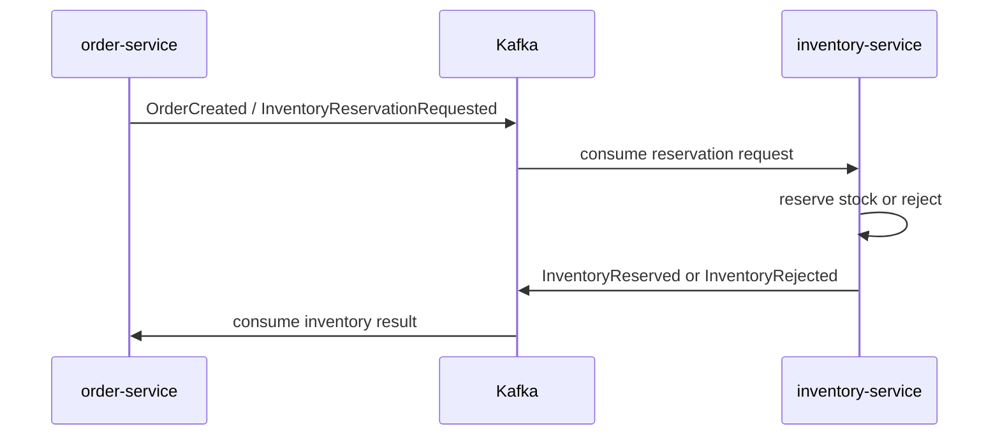

# inventory-service
Planned inventory service that will become the source of truth for stock levels, reservations, and stock adjustments.

## Purpose
`inventory-service` is declared as a Maven module but currently has no checked-in application source, resources, or runtime entry point.

The intended role is to move inventory concerns out of `product-service` and support event-driven stock workflows.

## Intended Responsibilities
- Own stock-on-hand and available-to-sell quantities.
- Manage reservations during order creation.
- Handle stock adjustments for receiving, corrections, cancellations, and fulfillment.
- Consume order-related events from Kafka.
- Publish reservation/stock result events back to the rest of the system.

## Current State
- `pom.xml` exists.
- `src/main/java`, `src/main/resources`, and test folders exist but contain no source files.
- No Spring Boot application class exists.
- No database configuration exists.
- No Kafka consumers/producers exist.

## Proposed Event Flow


Event names are suggestions only. <!-- TODO: verify event contract names -->

## How to Run & Test
- Prerequisites: Java 25 and Maven.
- Build:
  ```sh
  mvn -pl inventory-service clean package
  ```
- Run locally: no application class exists yet.
- Unit tests:
  ```sh
  mvn -pl inventory-service test
  ```
- Integration tests: none are present.
- Maven profiles: none are declared.
- Spring profiles/properties: none are present.

## Suggested Data Model
Potential entities once implemented:
- `InventoryItem`: product ID, SKU, quantity on hand, reserved quantity, available quantity.
- `InventoryReservation`: reservation ID, order ID, product ID, quantity, status, expiry timestamp.
- `StockAdjustment`: product ID, adjustment quantity, reason, created timestamp.

This is design guidance, not current code.

## TODO / Future Work
- Add Spring Boot dependencies and an application entry point.
- Add database configuration and migration scripts.
- Move `inventoryQuantity` responsibility out of `product-service`.
- Define Kafka event contracts for reservation requests and results.
- Add idempotency handling for event consumers.
- Add reservation expiry/release behavior.
- Add integration tests with PostgreSQL and Kafka/Testcontainers.
