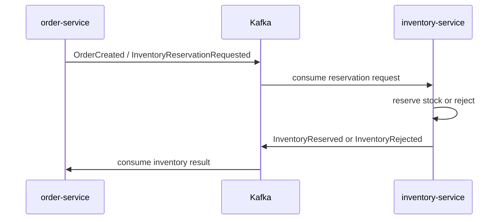

# inventory-service
Spring Boot inventory service that owns stock-on-hand, reserved quantity, available-to-sell calculation, and stock adjustment audit history.

## Purpose
`inventory-service` is the inventory boundary for ShopSphere. It is the source of truth for inventory quantities and keeps catalog ownership in `product-service`.

The first implementation slice supports admin stock adjustments and inventory read APIs. Reservation, Kafka event consumers/producers, and order-service integration remain planned follow-up work.

## Responsibilities
- Own stock-on-hand and available-to-sell quantities.
- Store reserved quantity separately from stock on hand.
- Derive available quantity as `quantityOnHand - reservedQuantity`.
- Handle admin stock adjustments for receiving, corrections, damage, returns, and manual removals.
- Persist stock adjustment audit records.
- Secure inventory write/read endpoints with JWT admin authorization.

## Key Classes
- `InventoryServiceApplication`: Spring Boot entry point.
- `InventoryController`: generated-contract inventory read endpoints.
- `AdminInventoryController`: generated-contract admin adjustment endpoints.
- `InventoryService`: inventory business rules.
- `InventoryMapper`: entity to generated DTO mapping.
- `InventoryItem`: JPA stock aggregate.
- `StockAdjustment`: JPA adjustment audit record.
- `InventoryItemRepository`, `StockAdjustmentRepository`: persistence access.
- `SecurityConfig`: stateless JWT security.
- `InventoryServiceControllerAdvice`: exception-to-HTTP mapping.

## REST API
Contract source: `specs/api/inventory-service-api.yaml`.

The Maven build generates Spring interfaces under `uk.co.ttingle.inventoryservice.generated.rest.v1` and DTOs under `uk.co.ttingle.inventoryservice.generated.rest.v1.dto`.

| Method | Path | Description |
|--------|------|-------------|
| `GET` | `/api/v1/inventory/{productId}` | Get full inventory state for a product. Requires `ADMIN`. |
| `GET` | `/api/v1/inventory/availability/{productId}` | Get available-to-sell inventory state. Requires `ADMIN` in the first slice. |
| `POST` | `/api/v1/admin/inventory/{productId}/adjustments` | Apply a stock adjustment. Requires `ADMIN`. |
| `GET` | `/api/v1/admin/inventory/{productId}/adjustments` | List stock adjustment audit records. Requires `ADMIN`. |

`StockAdjustmentRequest`:
```json
{
  "sku": "TSHIRT-001",
  "quantityDelta": 5,
  "reason": "RECEIVED",
  "reference": "PO-1001"
}
```

Rules:
- `quantityDelta` cannot be zero.
- `sku` is required when creating inventory for a product that does not yet have an inventory row.
- Adjustments cannot make `quantityOnHand` negative.
- Adjustments cannot make `quantityOnHand` lower than `reservedQuantity`.
- Existing inventory rows may update the SKU snapshot when a non-blank `sku` is provided.

## Data Model
`InventoryItem`:
- `id`: UUID.
- `productId`: unique catalog product UUID.
- `sku`: SKU snapshot/read convenience.
- `quantityOnHand`.
- `reservedQuantity`.
- `version`: optimistic locking column.
- `createdAt`, `updatedAt`.

`StockAdjustment`:
- `id`: UUID.
- `productId`.
- `sku`: snapshot at adjustment time.
- `quantityDelta`.
- `reason`: `RECEIVED`, `CORRECTION`, `DAMAGE`, `RETURN`, or `MANUAL_REMOVAL`.
- `reference`.
- `createdBy`: authenticated principal when available.
- `createdAt`.

## Configuration
Main configuration is in `src/main/resources/application.yml`.

| Property | Default | Notes |
|----------|---------|-------|
| `server.port` | `8080` | Docker Compose maps this to host `8084`. |
| `spring.datasource.url` | `jdbc:postgresql://localhost:5432/inventorydb` | Override with `DATABASE_URL`. |
| `spring.datasource.username` | `user` | Override with `DATABASE_USERNAME`. |
| `spring.datasource.password` | `password` | Override with `DATABASE_PASSWORD`. |
| `spring.jpa.hibernate.ddl-auto` | `update` | Replace with migrations later. |
| `security.jwt.secret` | `your_very_secret_jwt_secret_key_32` | Override with `JWT_SECRET`. |
| `security.jwt.expiration` | `3600000` | One hour. |

The test profile uses `ddl-auto=create-drop`.

## Proposed Event Flow


Event names are suggestions only. <!-- TODO: verify event contract names -->

## How to Run & Test
- Prerequisites: Java 25, Maven, PostgreSQL, Docker Compose, and `common-lib`.
- Preferred local path from the repo root:
  ```sh
  mvn -pl inventory-service -am clean package
  docker compose -f infra/local/docker-compose.yml up inventory-service postgres
  ```
- Direct Maven run:
  ```sh
  mvn -pl inventory-service spring-boot:run
  ```
- Unit tests:
  ```sh
  mvn -pl inventory-service -am test
  ```
- Integration tests:
  ```sh
  mvn -pl inventory-service -am test -DtestTags=integration
  ```
- Maven profiles: none are declared.

## Operational Notes
- The current implementation does not yet reserve or release stock for orders.
- Kafka is intentionally not wired in this first slice.
- Product inventory fields still exist in `product-service` until migration work is completed.
- Database migrations are not present yet; the service follows the current project convention of Hibernate `ddl-auto`.

## TODO / Future Work
- Move `inventoryQuantity` responsibility out of `product-service`.
- Define Kafka event contracts for reservation requests and results.
- Add idempotency handling for event consumers.
- Add reservation expiry/release behavior.
- Add Kafka/Testcontainers integration tests once event flow exists.
- Add database migrations with Flyway or Liquibase.
