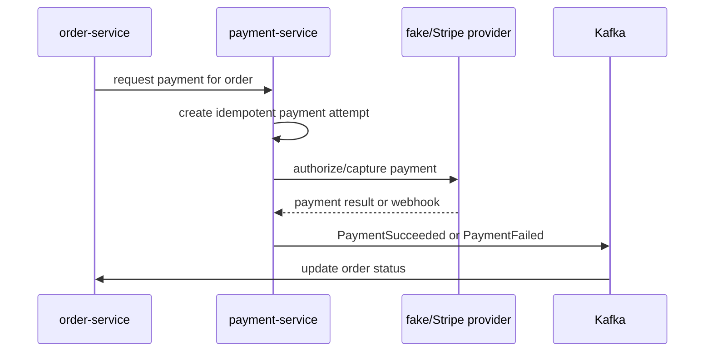

# payment-service
Planned payment service for transactional demo payments, future Stripe-style provider integration, webhook handling, and payment result events.

## Purpose
`payment-service` is declared as a Maven module but currently has no checked-in application source, resources, or runtime entry point.

The intended first implementation is a fake payment provider for portfolio/demo use, designed behind an abstraction that could later support Stripe.

## Intended Responsibilities
- Start payment attempts for orders.
- Keep payment state transactional and idempotent.
- Support a fake/demo provider first.
- Add a Stripe-style provider later.
- Receive and verify provider webhooks.
- Publish payment success/failure events for `order-service`.

## Current State
- `pom.xml` exists.
- `src/main/java`, `src/main/resources`, and test folders exist but contain no source files.
- No Spring Boot application class exists.
- No provider integration exists.
- No webhook routes exist.

## Proposed Payment Flow


Event and endpoint names are suggestions only. <!-- TODO: verify payment contract names -->

## Transactional Guidance
Payment should be treated as a state machine rather than a simple boolean:
- `PENDING`
- `AUTHORIZED`
- `CAPTURED`
- `FAILED`
- `CANCELLED`
- `REFUNDED`

For a learning project, a fake provider can make this easy to demonstrate while still preserving realistic architecture.

## How to Run & Test
- Prerequisites: Java 25 and Maven.
- Build:
  ```sh
  mvn -pl payment-service clean package
  ```
- Run locally: no application class exists yet.
- Unit tests:
  ```sh
  mvn -pl payment-service test
  ```
- Integration tests: none are present.
- Maven profiles: none are declared.
- Spring profiles/properties: none are present.

## TODO / Future Work
- Add Spring Boot application entry point.
- Add payment provider abstraction.
- Implement fake provider for demo mode.
- Add Stripe-compatible provider behind the same interface.
- Add idempotency keys for payment attempts.
- Add webhook endpoint and signature verification for real providers.
- Publish payment result events for `order-service`.
- Add integration tests around successful, failed, duplicate, and webhook-driven payments.
